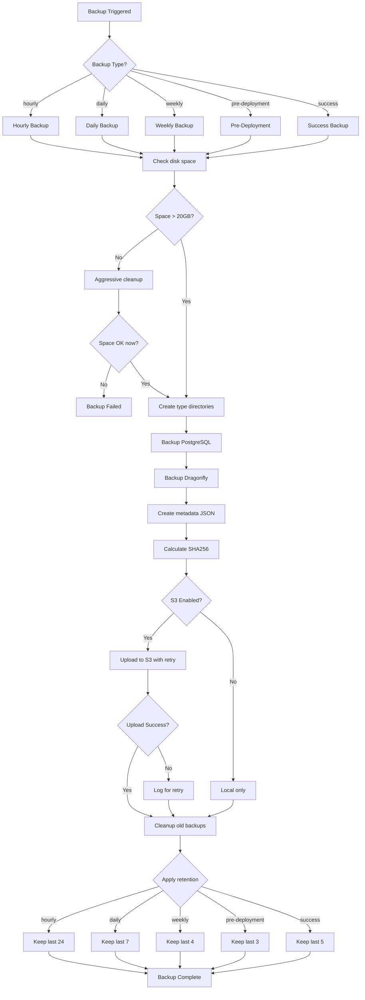
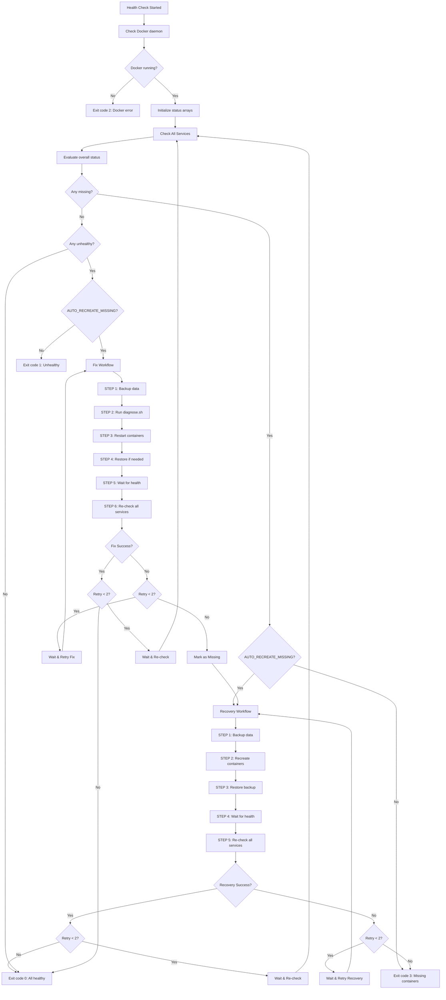

# Docker Infrastructure Scripts - Complete Guide

## Overview

Production-ready CI/CD deployment automation handling **20 edge cases** across
**7 Docker containers** (5 infrastructure + 2 application) with automated
backups (local + Contabo S3), deployment safety, automatic rollback, and
comprehensive monitoring.

> **📚 Related Documentation**: See
> [Docker Deployment Guide](../../docker/README.md) for Docker Compose
> configuration, environment setup, and manual deployment instructions.

---

## System Architecture

### Complete Infrastructure Stack

```
┌─────────────────────────────────────────────────────────────────────┐
│                         Production Server                            │
│                    (8 vCPU / 24GB RAM Target)                        │
├─────────────────────────────────────────────────────────────────────┤
│                                                                       │
│  Infrastructure Containers (Profile: infrastructure)                 │
│  ┌──────────────┐  ┌──────────────┐  ┌──────────────┐              │
│  │  PostgreSQL  │  │  Dragonfly   │  │  OpenVidu    │              │
│  │   :5432      │  │   :6379      │  │   :4443      │              │
│  │   10GB RAM   │  │   4GB RAM    │  │   4GB RAM    │              │
│  │   3 CPU      │  │   2 CPU      │  │   1.5 CPU    │              │
│  └──────────────┘  └──────────────┘  └──────────────┘              │
│                                                                       │
│  ┌──────────────┐  ┌──────────────┐                                │
│  │   Coturn     │  │  Portainer   │                                │
│  │   :3478      │  │   :9000      │                                │
│  │   1GB RAM    │  │   256MB RAM  │                                │
│  │   0.5 CPU    │  │   0.5 CPU    │                                │
│  └──────────────┘  └──────────────┘                                │
│                                                                       │
│  Application Containers (Profile: app)                               │
│  ┌──────────────┐  ┌──────────────┐                                │
│  │     API      │  │    Worker    │                                │
│  │   :8088      │  │   BullMQ     │                                │
│  │   6GB RAM    │  │   4GB RAM    │                                │
│  │   3 CPU      │  │   2 CPU      │                                │
│  └──────────────┘  └──────────────┘                                │
│                                                                       │
│  Docker Network: app-network (172.18.0.0/16)                        │
│  ├─ postgres:        172.18.0.2                                     │
│  ├─ dragonfly:       172.18.0.4                                     │
│  ├─ openvidu-server: 172.18.0.5                                     │
│  ├─ coturn:          172.18.0.6                                     │
│  └─ portainer:       172.18.0.9                                     │
└─────────────────────────────────────────────────────────────────────┘

┌─────────────────────────────────────────────────────────────────────┐
│                        Backup Storage                                │
├─────────────────────────────────────────────────────────────────────┤
│  Local: /opt/healthcare-backend/backups/                            │
│  ├── postgres/                                                       │
│  │   ├── hourly/           (24 files, 24h retention)               │
│  │   ├── daily/            (7 files, 7d retention)                 │
│  │   ├── weekly/           (4 files, 4w retention)                 │
│  │   ├── pre-deployment/   (3 files, last 3)                       │
│  │   ├── success/          (5 files, last 5)                       │
│  │   └── pre-migration/    (3 files, last 3)                       │
│  ├── dragonfly/            (same structure)                         │
│  └── metadata/             (JSON metadata for each backup)          │
│                                                                       │
│  Remote: Contabo S3 (s3://healthcare-backups/)                      │
│  └── Mirrors: daily, weekly, pre-deployment, success                │
│      (Hourly backups: local only)                                   │
└─────────────────────────────────────────────────────────────────────┘

┌─────────────────────────────────────────────────────────────────────┐
│                      CI/CD Pipeline (GitHub Actions)                 │
├─────────────────────────────────────────────────────────────────────┤
│  Jobs: 11 total                                                      │
│  1. lint              → Code quality (skipped)                       │
│  2. security          → Trivy + audit-ci                            │
│  3. docker-build      → Build & push to ghcr.io                     │
│  4. detect-changes    → Detect infra/app changes                    │
│  5. check-infrastructure → Health check (5 containers)              │
│  6. backup-infrastructure → Pre-deployment backup                   │
│  7. debug-infrastructure → Auto-fix unhealthy                       │
│  8. recreate-infrastructure → Rebuild missing containers            │
│  9. restore-backup    → Restore data after rebuild                  │
│  10. verify-infrastructure → Post-restore health check              │
│  11. deploy           → Application deployment                      │
└─────────────────────────────────────────────────────────────────────┘
```

---

## Complete Deployment Flow

### Main Deployment Process

```mermaid
flowchart TD
    Start[Push to main branch] --> DetectChanges[detect-changes job]

    DetectChanges --> CheckChanges{Changes?}
    CheckChanges -->|Infra Changed| FullPipeline[Full Pipeline]
    CheckChanges -->|App Only| AppPipeline[App Pipeline]
    CheckChanges -->|No Changes| Skip[Skip Deploy]

    FullPipeline --> Security[security scan]
    FullPipeline --> Build[docker-build]
    Security --> CheckInfra[check-infrastructure]
    Build --> CheckInfra

    CheckInfra --> InfraStatus{Infrastructure Status?}

    InfraStatus -->|All Healthy| BackupHealthy[backup-infrastructure]
    InfraStatus -->|Some Unhealthy| BackupUnhealthy[backup-infrastructure]
    InfraStatus -->|Some Missing| SkipBackup[Skip Backup]

    BackupHealthy --> Deploy[deploy job]
    BackupUnhealthy --> Debug[debug-infrastructure]
    SkipBackup --> Recreate[recreate-infrastructure]

    Debug --> DebugResult{Fix Successful?}
    DebugResult -->|Yes| Deploy
    DebugResult -->|No| Recreate

    Recreate --> Restore[restore-backup]
    Restore --> Verify[verify-infrastructure]
    Verify --> Deploy

    Deploy --> DeployScript[Run deploy.sh]
    DeployScript --> AcquireLock[Acquire deployment lock]
    AcquireLock --> ValidateDeps[Validate dependencies]
    ValidateDeps --> PreDeployBackup[Pre-deployment backup]
    PreDeployBackup --> PreMigrationBackup[Pre-migration backup]
    PreMigrationBackup --> RunMigrations[Run Prisma migrations]
    RunMigrations --> ValidateSchema[Validate schema]
    ValidateSchema --> DeployContainers[Deploy app containers]
    DeployContainers --> HealthCheck[Wait for health check]

    HealthCheck --> DeployStatus{Deploy Success?}
    DeployStatus -->|Yes| SuccessBackup[Create success backup]
    DeployStatus -->|No| Rollback[Rollback]

    Rollback --> HasSuccessBackup{Has success backup?}
    HasSuccessBackup -->|Yes| RestoreSuccess[Restore last success]
    HasSuccessBackup -->|No| RestorePreDeploy[Restore pre-deployment]

    SuccessBackup --> ReleaseLock[Release deployment lock]
    RestoreSuccess --> ReleaseLock
    RestorePreDeploy --> ReleaseLock

    ReleaseLock --> Complete[Deployment Complete]
```



### Backup Flow



### Health Check Flow (with Auto-Recovery)



---

## Quick Start

### 1. Setup Automated Backups

```bash
# Install cron jobs for automated backups
./backup.sh setup-cron

# Verify cron jobs
crontab -l | grep healthcare
```

### 2. Check Infrastructure Health

```bash
# Check all 5 infrastructure containers
./health-check.sh

# Expected output:
# ✓ PostgreSQL - healthy
# ✓ Dragonfly - healthy
# ✓ OpenVidu - healthy
# ✓ Coturn - healthy
# ✓ Portainer - healthy
```

### 3. Create Backup

```bash
# Pre-deployment backup
./backup.sh pre-deployment

# Success backup (after deployment)
./backup.sh success

# Scheduled backups (via cron)
./backup.sh hourly
./backup.sh daily
./backup.sh weekly
```

### 4. Deploy Application

```bash
# Full deployment with safety features
./deploy.sh

# Includes:
# - Pre-deployment backup
# - Migration safety
# - Automatic rollback on failure
# - Success backup after deployment
```

---

## Scripts Reference

### Main Scripts

| Script                     | Purpose                                              | Usage                                                          |
| -------------------------- | ---------------------------------------------------- | -------------------------------------------------------------- |
| `deploy.sh`                | Main deployment orchestrator                         | `./deploy.sh [options]`                                        |
| `health-check.sh`          | Infrastructure health monitoring                     | `./health-check.sh`                                            |
| `backup.sh`                | Backup management (PostgreSQL + Dragonfly)           | `./backup.sh [hourly\|daily\|weekly\|pre-deployment\|success]` |
| `restore.sh`               | Restore from backups                                 | `./restore.sh <backup-id>`                                     |
| `verify.sh`                | Deployment verification                              | `./verify.sh deployment` or `./verify.sh backup <backup-id>`   |
| `diagnose.sh`              | Diagnostic and troubleshooting                       | `./diagnose.sh`                                                |
| `setup-directories.sh`     | Setup required directories                           | `./setup-directories.sh`                                       |
| `fix-database-password.sh` | **NEW**: Verify and fix database password mismatches | `./fix-database-password.sh`                                   |
| `clean-and-rebuild.sh`     | **NEW**: Clean all containers and rebuild            | `./clean-and-rebuild.sh`                                       |

### Utility Scripts

| Script                       | Purpose                      |
| ---------------------------- | ---------------------------- |
| `incident-response.sh`       | Incident response automation |
| `monitor-and-alert.sh`       | Monitoring and alerting      |
| `reset-postgres-password.sh` | Reset PostgreSQL password    |

---

## Scripts Reference (Detailed)

### Core Scripts

| Script            | Purpose                               | Usage                      |
| ----------------- | ------------------------------------- | -------------------------- |
| `health-check.sh` | Check all 5 infrastructure containers | `./health-check.sh`        |
| `backup.sh`       | Create backups (local + S3)           | `./backup.sh <type>`       |
| `restore.sh`      | Restore from backup                   | `./restore.sh <backup-id>` |
| `deploy.sh`       | Deploy with safety features           | `./deploy.sh`              |
| `diagnose.sh`     | Auto-fix unhealthy containers         | `./diagnose.sh`            |

### Utility Scripts

| Script                 | Purpose                                    | Usage                                               |
| ---------------------- | ------------------------------------------ | --------------------------------------------------- |
| `backup.sh`            | Unified backup operations                  | `./backup.sh [type\|retry\|setup-cron]`             |
| `restore.sh`           | Unified restore operations                 | `./restore.sh [backup-id\|disaster id]`             |
| `verify.sh`            | Unified verification (deployment + backup) | `./verify.sh [deployment\|backup] [backup-id\|all]` |
| `monitor-and-alert.sh` | Performance monitoring & alerts            | Run via cron every 5 min                            |
| `incident-response.sh` | Quick incident resolution                  | `./incident-response.sh <issue-type>`               |

**Backup Subcommands:**

- `backup.sh hourly|daily|weekly|pre-deployment|success` - Create backup
- `backup.sh retry` - Retry failed S3 uploads
- `backup.sh setup-cron` - Setup automated backup cron jobs

**Restore Subcommands:**

- `restore.sh [backup-id]` - Restore from backup (local/S3)
- `restore.sh disaster [backup-id]` - Disaster recovery from S3 only

---

## Backup Types & Retention

| Type               | Frequency      | Retention | Storage    | Purpose         |
| ------------------ | -------------- | --------- | ---------- | --------------- |
| **Hourly**         | Every hour     | 24 hours  | Local      | Quick recovery  |
| **Daily**          | 2 AM           | 7 days    | Local + S3 | Regular backups |
| **Weekly**         | Sunday 3 AM    | 4 weeks   | Local + S3 | Long-term       |
| **Pre-Deployment** | Before changes | 3 backups | Local + S3 | Safety net      |
| **Success**        | After deploy   | 5 backups | Local + S3 | Rollback target |

### Backup Storage Structure

```
/opt/healthcare-backend/backups/
├── postgres/
│   ├── hourly/
│   ├── daily/
│   ├── weekly/
│   ├── pre-deployment/
│   └── success/
├── dragonfly/
│   └── (same structure)
└── metadata/
    └── *.json

Contabo S3: s3://healthcare-backups/
└── Mirrors local structure
```

---

## Infrastructure Containers

| Container           | Port              | Purpose                | Health Check           |
| ------------------- | ----------------- | ---------------------- | ---------------------- |
| **postgres**        | - (internal only) | PostgreSQL database    | `pg_isready`           |
| **dragonfly**       | 6379              | Redis-compatible cache | `redis-cli ping`       |
| **openvidu-server** | 4443              | Video conferencing     | HTTP check             |
| **coturn**          | 3478              | TURN/STUN server       | `turnutils_stunclient` |
| **portainer**       | 9000              | Docker management UI   | HTTP check             |

---

## Edge Cases Handled (20)

### Infrastructure (15)

1. ✅ Disk space exhaustion → Auto-cleanup
2. ✅ S3 upload failure → Retry with exponential backoff
3. ✅ Partial backup failure → Mark as partial, still usable
4. ✅ Concurrent deployments → Deployment lock
5. ✅ Backup corruption → Checksum verification
6. ✅ Database migration failure → Pre-migration backup + rollback
7. ✅ Container resource exhaustion → Memory/CPU monitoring
8. ✅ Network partition → Container connectivity checks
9. ✅ Zombie containers → Auto-cleanup
10. ✅ Disaster recovery → Full S3 restoration
11. ✅ Portainer health → Docker UI monitoring
12. ✅ Coturn health → TURN/STUN monitoring
13. ✅ Container dependencies → Validation before deploy
14. ✅ Deployment rollback → Automatic on failure
15. ✅ Backup retention → Type-specific cleanup

### API/Worker (5)

16. ✅ Prisma client missing → Entrypoint validation
17. ✅ Connection pool exhaustion → Monitor & alert
18. ✅ Worker queue backlog → Monitor & scale
19. ✅ Memory leaks → GC enabled + monitoring
20. ✅ Graceful shutdown → SIGTERM handling

---

## Performance Monitoring

### SLA Targets

| Metric            | Target  | Check Command                                                     |
| ----------------- | ------- | ----------------------------------------------------------------- |
| API Response Time | < 200ms | `curl -w "%{time_total}" http://localhost:8088/health`            |
| Database Query    | < 50ms  | `docker exec postgres psql -c "SELECT * FROM pg_stat_statements"` |
| CPU Usage         | < 70%   | `docker stats --no-stream`                                        |
| Memory Usage      | < 80%   | `docker stats --no-stream`                                        |
| Uptime            | 99.9%   | Health check logs                                                 |

### Automated Monitoring

```bash
# Runs every 5 minutes via cron
*/5 * * * * /opt/healthcare-backend/devops/scripts/docker-infra/monitor-and-alert.sh
```

---

## Incident Response

### Quick Commands

**High Memory Usage**

```bash
./incident-response.sh high-memory
```

**Database Connection Pool Exhausted**

```bash
./incident-response.sh db-connections
```

**Worker Queue Backlog**

```bash
./incident-response.sh worker-backlog
```

**Deployment Failed**

```bash
./incident-response.sh deployment-failed
```

**Disk Space Full**

```bash
./incident-response.sh disk-full
```

### Manual Diagnostics

**Check Container Logs**

```bash
docker logs latest-api --tail 100
docker logs postgres --tail 50
```

**Check Resource Usage**

```bash
docker stats --no-stream
```

**Check Database Connections**

```bash
docker exec postgres psql -U postgres -c "SELECT count(*) FROM pg_stat_activity;"
```

**Check Queue Size**

```bash
docker exec dragonfly redis-cli LLEN "bull:email:waiting"
```

---

## Deployment Flow

```
1. Acquire deployment lock (prevent concurrent)
2. Check infrastructure health (5 containers)
3. Validate dependencies (postgres, dragonfly, coturn)
4. Create pre-deployment backup
5. Create pre-migration backup
6. Run Prisma migrations safely
7. Validate schema
8. Deploy application containers
9. Wait for health check (120s timeout)
10. Create success backup
11. Release deployment lock

On Failure:
→ Rollback to last success backup
→ Or rollback to pre-deployment backup
```

---

## Testing

### Test Backups

```bash
# Test all backup types
./backup.sh hourly
./backup.sh daily
./backup.sh pre-deployment

# Verify backups
ls -lh /opt/healthcare-backend/backups/postgres/
./verify.sh backup all
```

### Test Health Checks

```bash
./health-check.sh
# Should report status for all 5 containers
```

### Test Deployment

```bash
./deploy.sh
# Should complete with success backup
```

### Test Disaster Recovery

```bash
# Create backup
BACKUP_ID=$(./backup.sh success)

# Simulate disaster
docker compose -f ../../docker/docker-compose.prod.yml down

# Restore from S3 (disaster recovery)
./restore.sh disaster "$BACKUP_ID"

# Or restore normally (local first, S3 fallback)
./restore.sh "$BACKUP_ID"

# Verify
./health-check.sh
```

---

## Environment Variables

Required for S3 backups (set in `.env.production` or GitHub secrets):

```bash
S3_ENABLED=true
S3_PROVIDER=contabo
S3_ENDPOINT=https://eu2.contabostorage.com
S3_REGION=eu-central-1
S3_BUCKET=healthcare-backups
S3_ACCESS_KEY_ID=your-access-key
S3_SECRET_ACCESS_KEY=your-secret-key
S3_FORCE_PATH_STYLE=true
```

---

## Troubleshooting

### Backup Failed

```bash
# Check disk space
df -h

# Check S3 credentials
aws s3 ls s3://healthcare-backups/ --endpoint-url https://eu2.contabostorage.com

# Check logs
tail -f /var/log/deployments/backup.log
```

### Deployment Failed

```bash
# Check logs
docker logs latest-api --tail 100

# Check health
./health-check.sh

# Manual rollback
./restore.sh $(find_last_backup "success")
```

### Container Unhealthy

```bash
# Diagnose
./diagnose.sh

# Check logs
docker logs <container-name> --tail 100

# Restart
docker restart <container-name>
```

---

## Files in This Directory

```
docker-infra/
├── README.md                    # This file
├── health-check.sh             # Infrastructure health monitoring
├── backup.sh                   # Unified backup (create, retry, setup-cron)
├── restore.sh                  # Unified restore (local/S3, disaster recovery)
├── deploy.sh                   # Deployment orchestration
├── diagnose.sh                 # Auto-fix unhealthy containers
├── verify.sh                   # Unified verification (deployment + backup)
├── setup-directories.sh        # Server directory setup
├── monitor-and-alert.sh        # Performance monitoring
├── incident-response.sh        # Quick incident resolution
└── reset-postgres-password.sh  # PostgreSQL password reset utility
```

---

## Support

### Related Documentation

- **[Docker Deployment Guide](../../docker/README.md)** - Docker Compose
  configuration, environment setup, Portainer UI, manual deployment
- **[Server Setup Guide](../../../docs/SERVER_SETUP_GUIDE.md)** - Complete
  server setup instructions
- **[Deployment Guide](../../../docs/DEPLOYMENT_GUIDE.md)** - CI/CD deployment
  pipeline
- **[GitHub Secrets Reference](../../../docs/GITHUB_SECRETS_REFERENCE.md)** -
  Environment variables

### Quick Links

- **Docker Compose Files**: `devops/docker/docker-compose.prod.yml`
- **Portainer UI**: http://localhost:9000 (Docker management dashboard)
- **Health Check Script**: `./health-check.sh`
- **Backup Script**: `./backup.sh <type>`
- **Deploy Script**: `./deploy.sh`

---

---

## GitHub Actions Data Protection

The CI/CD workflow includes comprehensive data protection measures to ensure
PostgreSQL and Dragonfly data is safely backed up before container recreation.

### Enhanced Jobs

#### 1. Backup Infrastructure Job (`backup-infrastructure`)

**Location**: `.github/workflows/ci.yml`

**Enhancements**:

- ✅ **Ensures containers are running** before backup
  - Checks if PostgreSQL container is running
  - Starts PostgreSQL if not running and waits for health (30 retries, 2s
    intervals)
  - Checks if Dragonfly container is running
  - Starts Dragonfly if not running and waits for health (20 retries, 2s
    intervals)
- ✅ **Explicit error handling** if containers fail to start
- ✅ **Clear logging** with emojis for visibility in GitHub Actions UI

**Flow**:

```
1. Check PostgreSQL container status
   ├─ Not running → Start and wait for health
   └─ Running → Continue

2. Check Dragonfly container status
   ├─ Not running → Start and wait for health
   └─ Running → Continue

3. Create backup
   ├─ PostgreSQL: pg_dump → compressed SQL
   ├─ Dragonfly: SAVE command → RDB snapshot
   └─ Upload to S3 (if configured)

4. Exit on failure (prevents data loss)
```

#### 2. Recreate Infrastructure Job (`recreate-infrastructure`)

**Location**: `.github/workflows/ci.yml`

**Enhancements**:

- ✅ **Volume preservation verification** before recreation
  - Checks if volumes exist (`docker_postgres_data`, `docker_dragonfly_data`)
  - Verifies bind mount paths exist
  - Creates missing directories if needed
- ✅ **Ensures containers are running** before graceful stop
  - Starts containers if not running (for data flush)
  - Waits for containers to be ready
- ✅ **Graceful container shutdown**
  - Uses `docker compose stop` (respects `stop_grace_period`)
  - Falls back to `docker compose kill` if graceful stop fails
  - Waits 3 seconds for data to flush to disk
- ✅ **Health checks after recreation**
  - Waits for PostgreSQL to be ready (30 retries, 2s intervals)
  - Waits for Dragonfly to be ready (20 retries, 2s intervals)
  - Verifies volumes still exist after recreation

### Safety Features

1. **Fail-Fast on Backup Failure**
   - If backup fails, the workflow **aborts immediately**
   - Prevents data loss by stopping deployment before container recreation

2. **Container Health Verification**
   - Containers must be **healthy** before backup
   - Containers must be **healthy** after recreation
   - Retry logic with timeouts prevents infinite waiting

3. **Volume Preservation**
   - **Bind mounts** ensure data persists even if containers are removed
   - Volume paths are verified before and after recreation
   - Missing directories are created automatically

4. **Graceful Shutdown**
   - Containers stop with configured `stop_grace_period` (1 minute for
     PostgreSQL)
   - Data is flushed to disk before container removal
   - Fallback to force stop if graceful stop fails

### Workflow Dependencies

```
detect-changes
    ↓
check-infrastructure
    ↓
backup-infrastructure (Ensures containers running, creates backup)
    ↓
debug-infrastructure
    ↓
recreate-infrastructure (Verifies volumes, graceful stop, health checks)
    ↓
restore-backup
    ↓
verify-infrastructure
    ↓
deploy
```

### Logging and Visibility

All critical steps include emoji indicators for easy identification in GitHub
Actions UI:

- 🔍 **Verifying/Checking** - Verification steps
- ✅ **Success** - Successful operations
- ⚠️ **Warning** - Non-critical issues
- ❌ **Error** - Critical failures
- 💾 **Backup** - Backup operations
- 🛑 **Stop** - Container shutdown
- 🔄 **Recreate** - Container recreation
- ⏳ **Waiting** - Health check retries

---

## Implementation Status

### ✅ Completed Features (Docker Infrastructure)

All Docker infrastructure management features have been successfully
implemented:

1. **Docker Compose Profiles** ✅
   - Infrastructure services: `postgres`, `dragonfly`, `openvidu-server`,
     `coturn`, `portainer`
   - Application services: `api`, `worker`
   - Health checks configured for all services
   - Bind mount volumes for direct host access

2. **Scripts Organization** ✅
   - Organized structure: `shared/`, `dev/`, `docker-infra/`, `kubernetes/`
   - Clear separation between development and production
   - Platform-specific separation (Docker vs Kubernetes)

3. **All Docker Infrastructure Scripts** ✅
   - `setup-directories.sh`: Server directory management
   - `deploy.sh`: Smart deployment orchestrator
   - `health-check.sh`: Infrastructure health monitoring
   - `backup.sh`: Unified backup system (create, retry, setup-cron)
   - `restore.sh`: Unified restore system (local/S3, disaster recovery)
   - `diagnose.sh`: Auto-debugging
   - `verify.sh`: Unified verification (deployment + backup)

4. **GitHub Actions Integration** ✅
   - Complete workflow with all jobs
   - Change detection
   - Conditional execution based on changes and health
   - Error handling and rollback

5. **Dual-Backup Strategy** ✅
   - Local server storage (primary)
   - Contabo S3 storage (secondary/remote)
   - Backup retention policy
   - Checksum verification

### Quick Reference: What Gets Deployed When?

| Change Type               | Infrastructure    | Application         | Backup Required?          |
| ------------------------- | ----------------- | ------------------- | ------------------------- |
| App code only             | ❌ No             | ✅ Yes              | ❌ No                     |
| Infrastructure Dockerfile | ✅ Yes            | ✅ Yes (if changed) | ✅ Yes                    |
| Docker Compose config     | ✅ Yes            | ✅ Yes (if changed) | ✅ Yes                    |
| Database migration        | ❌ No             | ✅ Yes              | ❌ No (migration handles) |
| Infrastructure unhealthy  | ✅ Yes (recreate) | ✅ Yes (if changed) | ✅ Yes                    |

### Environment Variables Checklist

**Required GitHub Variables:**

- [ ] `S3_ENABLED=true`
- [ ] `S3_PROVIDER=contabo`
- [ ] `S3_ENDPOINT=https://eu2.contabostorage.com`
- [ ] `S3_REGION=eu-central-1`
- [ ] `S3_BUCKET=healthcare-backups`
- [ ] `S3_FORCE_PATH_STYLE=true`

**Required GitHub Secrets:**

- [ ] `S3_ACCESS_KEY_ID` (Contabo access key)
- [ ] `S3_SECRET_ACCESS_KEY` (Contabo secret key)

**Server Requirements:**

- [ ] `/opt/healthcare-backend/data/postgres` directory exists
- [ ] `/opt/healthcare-backend/data/dragonfly` directory exists
- [ ] `/opt/healthcare-backend/backups/` directory exists (for local backups)
- [ ] `/opt/healthcare-backend/devops/scripts/` directory exists
- [ ] `/var/log/deployments/` directory exists
- [ ] Docker daemon running
- [ ] Sufficient disk space: 3x database size free space

---

**Status**: ✅ Production Ready

**Last Updated**: 2026-01-02
