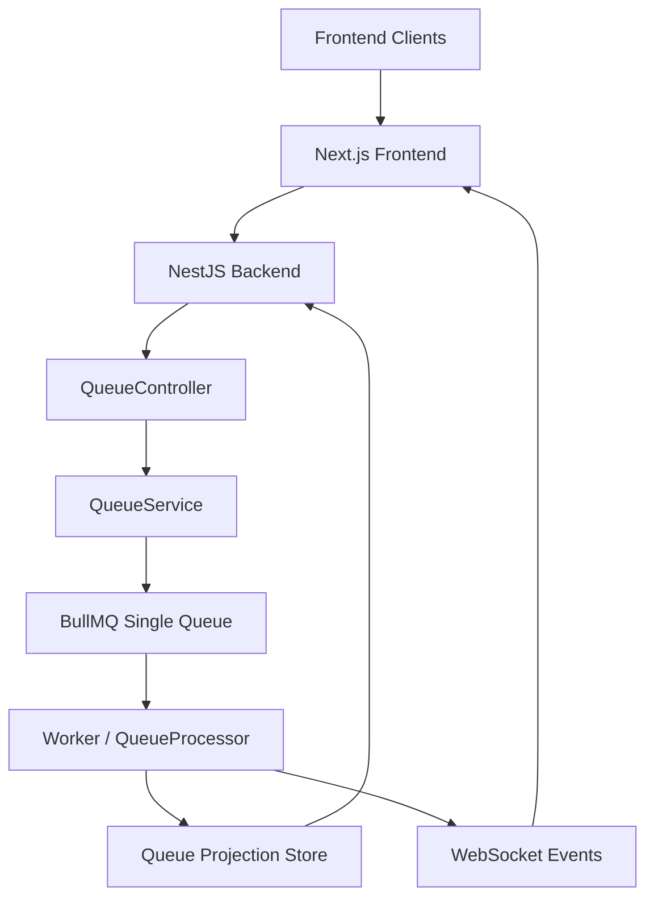
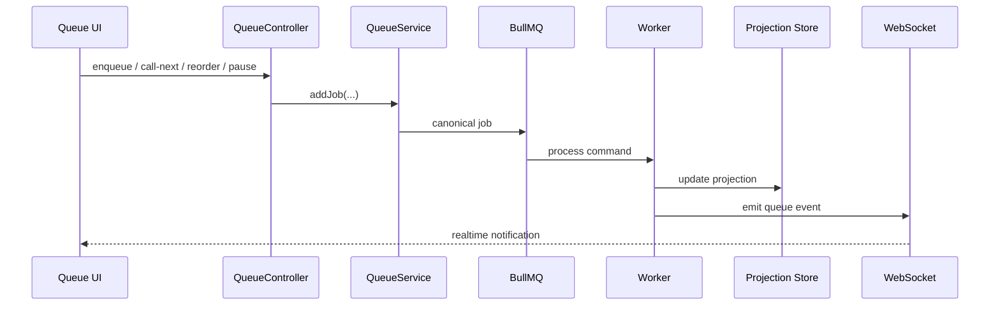
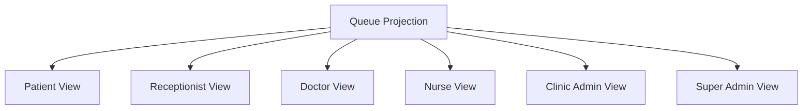

# Unified Queue README

## Purpose

This document defines the target enterprise queue architecture for HealthCareApp.

The design goal is:

- one physical BullMQ queue
- one worker pipeline
- one canonical job envelope
- one operational queue projection for UI
- many logical queues exposed by filters
- realtime updates through sockets

This model supports:

- multi-clinic
- multi-location
- doctor-wise queues
- treatment-wise queues
- receptionist queue operations
- clinic admin monitoring
- super admin cross-clinic visibility

## Executive Summary

BullMQ should be the command and processing backbone.

The live queue UI should not read raw BullMQ jobs directly. Instead, the worker should update a queue projection store that is optimized for:

- ordering
- filtering
- wait times
- doctor ownership
- location ownership
- treatment lanes
- realtime UI refresh

Recommended split:

```text
BullMQ = command processing
Projection store = operational queue state for UI
WebSocket = realtime delivery to clients
Bull Board = ops dashboard, not clinical queue UI
```

## Architecture Principles

1. One physical queue
   All queue commands are enqueued into one BullMQ queue, for example `healthcare-queue`.

2. One canonical envelope
   Every job must use the same payload structure.

3. Projection-first UI
   Frontend queue screens must read the projection store, not raw BullMQ jobs.

4. Logical queues by filtering
   The product can show many queues without creating many physical queues.

5. Role-filtered views
   Every role sees the same projection through different filters and actions.

6. Realtime consistency
   Worker updates projection, then emits socket events, then clients refetch or reconcile.

## Target Architecture

```text
Frontend Clients
  -> Next.js UI and server actions
  -> NestJS queue APIs
  -> QueueService.addJob(...)
  -> BullMQ single queue
  -> Worker / QueueProcessor
  -> Queue projection store
  -> WebSocket event emission
  -> Role-filtered queue UI
```

## Core Components

### 1. Command Queue

The physical BullMQ queue receives command jobs such as:

- `queue.enqueue`
- `queue.confirm`
- `queue.call_next`
- `queue.start_consultation`
- `queue.complete`
- `queue.pause`
- `queue.resume`
- `queue.reorder`
- `queue.cancel`
- `notification.send`

### 2. Canonical Job Envelope

Every job should conform to a single envelope:

```ts
type CanonicalQueueJobEnvelope<T = Record<string, unknown>> = {
  jobType: string;
  action: string;
  priority: "LOW" | "NORMAL" | "HIGH" | "URGENT";
  tenantId?: string;
  clinicId: string;
  locationId?: string;
  data: T;
  metadata: {
    correlationId?: string;
    auditLevel?: string;
    classification?: string;
    createdAt: string;
    actorUserId?: string;
    actorRole?: string;
  };
};
```

Business fields must live inside `data`.

The outer envelope must not be mutated by ad hoc field merges.

### 3. Queue Projection Store

The projection is the read model used by all queue screens.

It should store fields like:

- `entryId`
- `appointmentId`
- `patientId`
- `patientName`
- `clinicId`
- `locationId`
- `queueOwnerId`
- `assignedDoctorId`
- `queueCategory`
- `queueLane`
- `treatmentType`
- `status`
- `position`
- `estimatedWaitTime`
- `startedAt`
- `completedAt`
- `paused`
- `tokenNumber`
- `scheduledDate`

This projection can live in Redis, database tables, or a hybrid store. The critical point is that it must be:

- ordered
- queryable
- mutable by business workflow
- easy to filter by role

### 4. WebSocket Layer

Whenever the worker updates the projection, it should emit queue events such as:

- `queue.updated`
- `queue.position.updated`
- `queue.entry.started`
- `queue.entry.completed`
- `queue.paused`
- `queue.resumed`

The UI should subscribe with clinic and location filters.

### 5. Bull Board

Bull Board should remain an operational dashboard for:

- waiting jobs
- active jobs
- failed jobs
- delayed jobs
- retries
- processing latency

Bull Board should not be treated as the patient queue UI.

## Logical Queues From One Physical Queue

The system can expose many queue views while still using one physical queue.

Examples:

- clinic queue
- location queue
- doctor queue
- consultation queue
- agnikarma queue
- panchakarma queue
- shirodhara queue
- waiting patients
- in-progress patients
- completed patients

These are all filters on the same projection.

## Role-Wise Flow

### Patient

Patient flow should show:

- appointment status
- payment status
- queue status if applicable
- video or in-person pathway

Patients do not manage queue order directly.

### Receptionist

Receptionist actions:

- check in patient
- enqueue patient
- move patient
- pause or resume queue
- call next for doctor
- view clinic and location queues

Receptionist view is clinic-scoped and location-aware.

### Doctor

Doctor actions:

- view assigned queue
- start consultation
- complete consultation
- call next
- reorder assigned queue

Doctor view is doctor-scoped and location-aware.

### Nurse

Nurse actions:

- pre-consultation readiness
- vitals completion
- readiness status updates

Nurse view is lane-specific and operational.

### Clinic Admin

Clinic admin view should show:

- all clinic queues
- location-level backlog
- doctor throughput
- queue wait times
- paused queues
- capacity issues

### Super Admin

Super admin view should show:

- cross-clinic queue health
- backlog trends
- failed processing
- worker health
- clinic comparison

## Current Product Rules

The following rules should stay explicit:

- video appointments that require payment must not become confirmed before payment success
- queue commands must be auditable
- queue actions must be role-guarded
- all queue writes must carry clinic context
- frontend queue UIs must not trust inferred state when authoritative backend state exists

## Main Flows

### Enqueue

```text
UI action
-> Queue API
-> add BullMQ command
-> worker validates
-> projection entry created
-> socket event emitted
-> UI updates
```

### Call Next

```text
Doctor or receptionist action
-> call-next command
-> worker resolves the next eligible queue entry
-> entry status becomes IN_PROGRESS
-> projection order and wait metrics update
-> socket event emitted
```

### Pause Queue

```text
UI pause action
-> pause command
-> worker marks queue or owner lane paused
-> projection updates
-> socket event emitted
```

### Reorder

```text
UI reorder action
-> reorder command with ordered ids
-> worker validates scope and permissions
-> projection positions recomputed
-> socket event emitted
```

## Mermaid Diagrams

### End-to-End Architecture



### Operational Queue Flow



### Role-Based Projection Views



## Guardrails

Do not:

- create physical queues per clinic, location, or doctor
- use Bull Board as the doctor queue UI
- mix raw BullMQ job states with operational patient ordering in frontend
- mutate canonical envelopes inconsistently

Do:

- keep one physical queue
- keep one canonical envelope
- keep one projection read model
- derive all UI queues from filters
- emit realtime updates from projection changes

## Recommended Next Step

Adopt the phased plan in [UNIFIED_QUEUE_PRODUCTION_IMPLEMENTATION_PLAN.md](./UNIFIED_QUEUE_PRODUCTION_IMPLEMENTATION_PLAN.md).

## Current Status: Integrated vs Remaining

### Integrated

- Single BullMQ worker fallback now handles `notification_send`.
- Duplicate queue controller handlers for config, capacity, and export were removed.
- Queue controller behavior is now effectively clinic-only and no longer depends on runtime domain parsing for core queue flows.
- Frontend queue server actions no longer send `domain` for queue operations.
- Queue fetch actions now forward `date`.
- Queue page no longer uses realtime queue-status payload as the active row-data source.
- Queue page now uses the dedicated pause endpoint.
- Queue page `Call Next` is now scoped to the row doctor instead of a generic session user fallback.
- `patchJobData()` preserves the canonical BullMQ envelope by patching inner `data`.
- `updateJob()` also preserves inner `data` for canonical BullMQ envelopes.
- Autoscaler and fake worker creation logic were removed from the queue service.

### Remaining

- The system is still hybrid. Doctor-facing operational queues still rely on `AppointmentQueueService` and Redis list-based queue state, while BullMQ is used for generic/background queue jobs.
- `Call Next` still has a semantic mismatch:
  the UI presents it on a specific confirmed row, but backend behavior still advances the first `WAITING` patient for that doctor.
- The full target architecture is not yet complete:
  - all queue mutations are not yet BullMQ-command-driven
  - one unified queue projection store is not yet the sole read model
  - frontend queue screens do not yet read exclusively from a single projection API
  - Bull Board is not yet fully isolated as an ops-only surface in practice
- Some low-priority dead contract fields still remain in controller request body types even though behavior is hardcoded to clinic mode.

### Practical Verdict

Current queue work is mostly stabilized for the recent integration fixes.

However, the long-term target described in this README is still only partially implemented.

Today’s system should be understood as:

```text
Improved hybrid queue architecture
not yet
fully unified BullMQ + projection architecture
```
